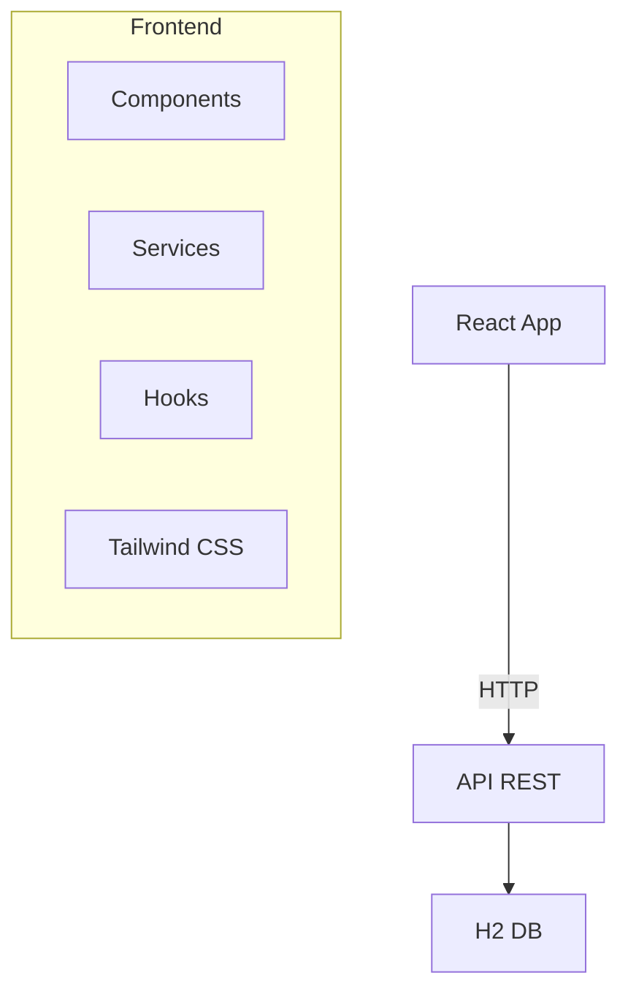

# Design

## Visão Geral

SPA React mobile-first para CRUD pessoas via API REST. Tailwind CSS, sem Bootstrap.

## Arquitetura



### Stack

- React 18 + Vite
- Tailwind CSS
- Axios
- React Router
- Heroicons

## Componentes

### Hierarquia
```
App
├── Layout (Header/Footer)
├── Pages (List/Add/Edit/Health)
└── Shared (PersonCard/PersonForm/Loading/Error)
```

### Componentes Principais

#### PersonCard
- Card com sombra Tailwind
- Avatar por gênero
- Layout flexível: nome, email, data
- Botões editar/excluir com ícones
- Hover e transições

#### PersonForm
- Inputs customizados Tailwind
- Select gênero customizado
- Input data HTML5
- Validação tempo real
- Botões com gradientes
- Layout responsivo grid

### API Service
```javascript
class PessoaService {
  static async listarPessoas()
  static async buscarPessoa(id)
  static async criarPessoa(pessoa)
  static async atualizarPessoa(id, pessoa)
  static async removerPessoa(id)
  static async verificarHealth()
}
```

## Modelos de Dados

```typescript
interface Pessoa {
  id?: number;
  nome: string;
  email: string;
  telefone?: string; // (XX) XXXXX-XXXX
  genero: 'Masculino' | 'Feminino' | 'Não Informado';
  dataNascimento: string; // YYYY-MM-DD
}
```

## Design System

### Tema
- Paleta cores customizada
- Modo escuro/claro
- Tipografia responsiva

### Componentes
- Layout: Header/Footer flexbox
- Navegação: Menu mobile hamburger
- Formulários: Inputs/selects/botões
- Cards: Sombras e bordas
- Feedback: Toast e loading
- Ícones: Heroicons

### Sistema
- Espaçamento: 4px base
- Tipografia: Escala responsiva
- Cores: Paleta consistente
- Sombras: Elevação box-shadow
- Bordas: Radius consistente
- Transições: Animações suaves

### Responsividade
- Mobile-first breakpoints
- Grid responsivo
- Classes condicionais

## Tratamento de Erros

- Rede: "Erro de conexão"
- Validação: Mensagens por campo
- API: Exibir mensagem retornada
- Toast notifications

## Otimizações Produção

### Build
- Vite: Tree-shaking nativo
- Rollup: Otimizações avançadas
- Terser: Minificação JS
- PostCSS: Minificação CSS
- Gzip/Brotli: Compressão assets

### Performance
- Code Splitting: React.lazy()
- Lazy Loading: Componentes demanda
- Bundle Analysis: webpack-bundle-analyzer
- Source Maps: Debugging produção
- Asset Optimization: Compressão imagens

### Config Vite
```javascript
export default {
  build: {
    minify: 'terser',
    sourcemap: true,
    rollupOptions: {
      output: {
        manualChunks: {
          vendor: ['react', 'react-dom'],
          router: ['react-router-dom']
        }
      }
    }
  }
}
```

## Testes

- Jest: Framework testes
- React Testing Library: Componentes
- MSW: Mock API