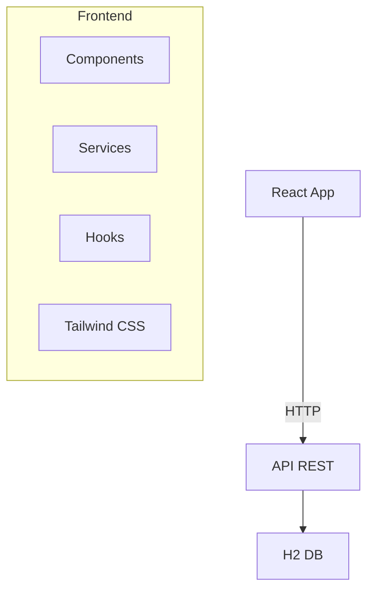

# Design

## Visão Geral

SPA React mobile-first para CRUD de pessoas via API REST. Interface moderna e responsiva usando Tailwind CSS e HTML/CSS customizado, sem dependências de frameworks de UI como Bootstrap ou Material-UI.

## Arquitetura



### Stack Tecnológico

- **Frontend**: React 18 + Vite
- **Estilo**: Tailwind CSS + CSS customizado (sem Bootstrap/Material-UI)
- **HTTP**: Axios
- **Roteamento**: React Router
- **Estado**: React Hooks
- **Ícones**: Heroicons ou Lucide React

## Componentes

### Hierarquia
```
App
├── Layout (Header/Footer)
├── Pages (List/Add/Edit/Health)
└── Shared (PersonCard/PersonForm/Loading/Error)
```

### Componentes Principais

#### PersonCard
- Card customizado com sombra usando Tailwind CSS
- Avatar circular com iniciais ou ícone baseado no gênero
- Layout flexível com nome, email, data nascimento
- Botões de ação (editar/excluir) com ícones Heroicons
- Hover effects e transições suaves

#### PersonForm
- Inputs customizados com Tailwind CSS styling
- Select dropdown customizado para gênero
- Input de data nativo do HTML5
- Validação em tempo real com mensagens de erro
- Botões estilizados com gradientes e hover effects
- Layout responsivo com grid system do Tailwind

### API Service
```javascript
class PessoaService {
  static async listarPessoas()
  static async buscarPessoa(id)
  static async criarPessoa(pessoa)
  static async atualizarPessoa(id, pessoa)
  static async removerPessoa(id)
  static async verificarHealth()
}
```

## Modelos de Dados

```typescript
interface Pessoa {
  id?: number;
  nome: string;
  email: string;
  telefone?: string; // (XX) XXXXX-XXXX
  genero: 'Masculino' | 'Feminino' | 'Não Informado';
  dataNascimento: string; // YYYY-MM-DD
}
```

## Design System com Tailwind CSS

### Tema e Cores
- Paleta de cores customizada usando Tailwind config
- Variáveis CSS para cores primárias e secundárias
- Modo escuro/claro usando Tailwind dark mode
- Tipografia responsiva com classes Tailwind

### Componentes Customizados
- **Layout**: Header/Footer com flexbox e grid
- **Navegação**: Menu mobile com hamburger customizado
- **Formulários**: Inputs, selects e botões estilizados
- **Cards**: Componentes de cartão com sombras e bordas
- **Feedback**: Toast notifications e loading spinners
- **Ícones**: Heroicons para consistência visual

### Sistema de Design
- **Espaçamento**: Sistema de spacing do Tailwind (4px base)
- **Tipografia**: Escala tipográfica responsiva
- **Cores**: Paleta consistente com variações de tom
- **Sombras**: Sistema de elevação com box-shadow
- **Bordas**: Border radius consistente
- **Transições**: Animações suaves para interações

### Responsividade
- Mobile-first approach com breakpoints Tailwind
- Grid responsivo para diferentes tamanhos de tela
- Componentes adaptativos usando classes condicionais

## Tratamento de Erros

### Estratégia
- Erros de rede: "Erro de conexão"
- Erros de validação: Mensagens específicas por campo
- Erros da API: Exibir mensagem retornada
- Toast notifications para feedback

## Otimizações de Produção

### Build Otimizado
- **Vite**: Build tool com tree-shaking nativo
- **Rollup**: Bundler com otimizações avançadas
- **Terser**: Minificação JS
- **PostCSS**: Minificação CSS com cssnano
- **Gzip/Brotli**: Compressão de assets

### Performance
- **Code Splitting**: React.lazy() para rotas
- **Lazy Loading**: Componentes sob demanda
- **Bundle Analysis**: webpack-bundle-analyzer
- **Source Maps**: Para debugging produção
- **Asset Optimization**: Compressão imagens

### Configurações Vite
```javascript
// vite.config.js otimizado
export default {
  build: {
    minify: 'terser',
    sourcemap: true,
    rollupOptions: {
      output: {
        manualChunks: {
          vendor: ['react', 'react-dom'],
          router: ['react-router-dom']
        }
      }
    }
  }
}
```

## Estratégia de Testes

### Ferramentas
- **Jest**: Framework de testes
- **React Testing Library**: Testes de componentes
- **MSW**: Mock da API

### Cobertura
- Componentes: Renderização e interações
- Services: Chamadas à API
- Hooks: Lógica de estado